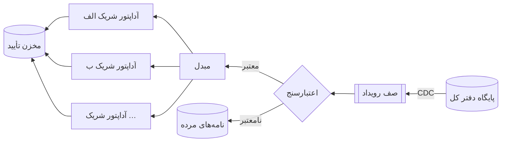
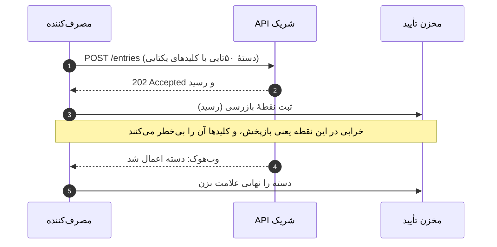
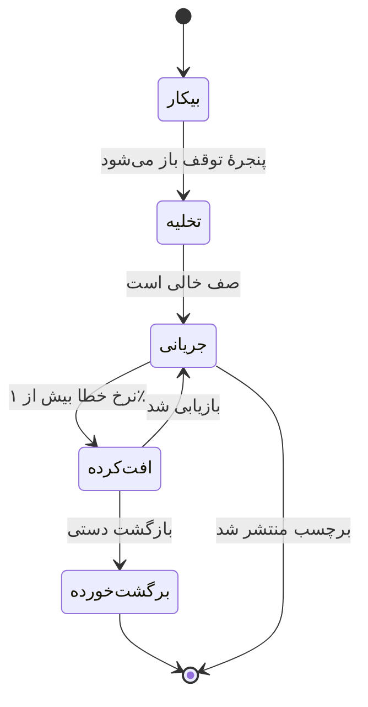
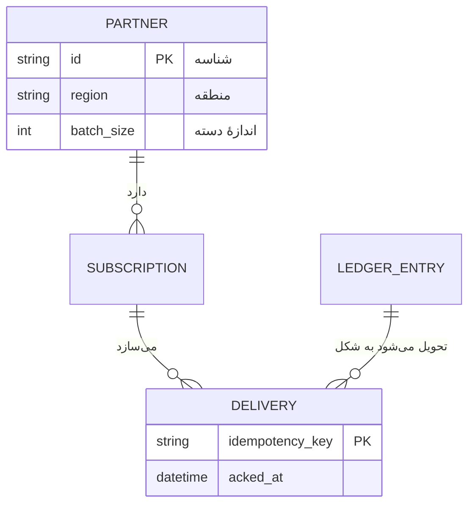
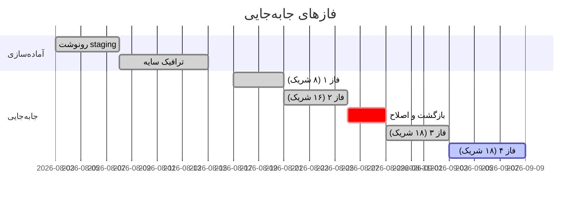
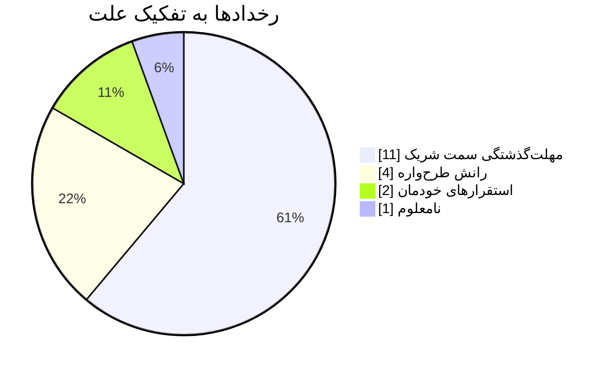

# همگام‌سازی دفتر کل: گزارش مهاجرت و مرجع فنی

*سند محک نمای رندرشده و خروجی PDF جات، به فارسی. همهٔ امکانات رندرکننده را در بالاترین حد طول و پیچیدگی، در متنی راست‌به‌چپ و آمیخته با انگلیسی، به کار می‌گیرد. آن را به PDF ببرید و تک‌تک صفحه‌ها را بسنجید. بخش ۱۰ عمداً پر از خطاست، برای آزمودن بازبینی سبک.*

**وضعیت:** ~~پیش‌نویس~~ نهایی · **مسئول:** تیم پلتفرم · **آخرین بازبینی:** ۱۴۰۵/۰۷/۱۵

---

## ۱. خلاصه

مهاجرت همگام‌سازی دفتر کل همهٔ یکپارچه‌سازی‌های شرکا را از صادرکنندهٔ دسته‌ای قدیمی به یک خط لولهٔ جریانی (streaming pipeline) برد. جابه‌جایی در **چهار فاز** و طی شش هفته انجام شد، *بی* هیچ قطعی‌ای که مشتری ببیند و با یک بازگشت (rollback) که [گزارش بازگشت](https://example.com/rollback-log "گزارش داخلی بازگشت") جزئیاتش را ثبت کرده است. این گزارش روند کار، دلیل‌های طراحی، نتیجه‌های تأخیر هر شصت شریک و آنچه مهندس کشیک لازم دارد را پوشش می‌دهد.

عددهای اصلی: میانهٔ تأخیر سرتاسری از `412 ms` به `68 ms` رسید، مصرف بودجهٔ خطا ۷۱٪ کم شد و پنجرهٔ دسته‌ای شبانه، که پیش‌تر چهار ساعت بود، دیگر وجود ندارد. داشبوردهای پشت این عددها در [منابع](#منابع) آمده‌اند.

> **یادداشت برای خوانندگان PDF:** جدول‌ها، بلوک‌های کد، نمودارها و فرمول‌ها نباید میان دو صفحه بشکنند؛ جز جدول شرکا در بخش ۵، که از یک صفحه بلندتر است و *باید* با سرستون تکرارشده به صفحهٔ بعد برود.

## ۲. پیش‌زمینه

### ۲.۱ چرا صادرکنندهٔ دسته‌ای باید کنار می‌رفت

صادرکنندهٔ دسته‌ای در سال ۲۰۱۹ برای هشت شریک نوشته شد. حالا به شصت شریک خدمت می‌دهد و سه مشکل ساختاری روی هم انباشته شده‌اند:

1. هر شب **کل** دفتر را می‌خواند، پس زمان اجرا با تاریخچه رشد می‌کند، نه با تغییرات.
2. تا وقتی اجرا می‌شود جدول‌های تطبیق را قفل نگه می‌دارد و این قفل جلوی این‌ها را می‌گیرد:
   1. اصلاح‌های دستی تیم مالی،
   2. کار امتیازدهی تقلب (fraud scoring)، و
   3. هر مهاجرت طرح‌واره (schema)، هر قدر هم کوچک.
3. شکست‌ها همه‌یا‌هیچ‌اند: یک رکورد معیوب اجرا را برای همهٔ شرکا متوقف می‌کند.

### ۲.۲ محدودیت‌ها

- **بی‌قطعی.** شرکا با زمان‌بندی خودشان درخواست می‌فرستند؛ بعضی هر دقیقه.
- **بی‌تحویل دوباره.** هر ردیف دفتر برای هر شریک *دقیقاً یک بار* تحویل می‌شود.
  - کلیدهای یکتایی (idempotency keys) از شناسهٔ ردیف و شناسهٔ شریک ساخته می‌شوند.
  - بازپخش پس از خرابی باید بی‌خطر باشد.
    - مصرف‌کننده *پس از* تأیید شریک نقطهٔ بازرسی (checkpoint) ثبت می‌کند.
    - ردیف بازپخش‌شده‌ای که کلیدش شناخته‌شده است بی‌صدا کنار می‌رود.
- **برگشت‌پذیر تا برچسب انتشار.** هر قدمی پیش از برچسب انتشار در کمتر از پنج دقیقه برمی‌گردد.

### ۲.۳ چک‌لیست پیش از شروع

- [x] رونوشت staging با دادهٔ تولید پر شد
- [x] ترافیک سایه (shadow traffic) یک هفته بی‌خطا اجرا شد
- [x] راهنمای اجرا با تیم کشیک مرور شد
- [ ] ممیزی پس از مهاجرت
- [ ] انتقال دو شریک باقی‌مانده

## ۳. معماری

### ۳.۱ جریان داده



### ۳.۲ دست‌دادن تحویل



### ۳.۳ وضعیت‌های اجزا



### ۳.۴ مدل داده



## ۴. ریاضیِ اندازهٔ دسته

هر آداپتور شریک دسته‌هایی به اندازهٔ $b$ می‌فرستد. با سربار $o$ برای هر درخواست و هزینهٔ $c$ برای هر ردیف، زمان تخلیهٔ صفی با $n$ ردیف چنین است:

$$
T(b) = \left\lceil \frac{n}{b} \right\rceil \cdot o \;+\; n \cdot c
$$

و شمار مورد انتظار ردیف‌های در خطر هنگام خرابی $\mathbb{E}[R] = \tfrac{b}{2}$ است، چون خرابی به‌طور یکنواخت جایی درون یک دسته رخ می‌دهد. ترازکردن زمان تخلیه با هزینهٔ بازپخش این هدف را می‌دهد:

$$
J(b) = \alpha \frac{n\,o}{b} + \beta \frac{b}{2}, \qquad b^{*} = \sqrt{\frac{2\,\alpha\, n\, o}{\beta}}
$$

برای شرکایی که هدف تأخیر سخت‌گیرانه دارند دنبالهٔ توزیع را هم محدود می‌کنیم. اگر تأخیرها لگ‌نرمال با پارامترهای $\mu, \sigma$ باشند، صدک ۹۹ می‌شود:

$$
p_{99} = \exp\!\left(\mu + \sigma\,\Phi^{-1}(0.99)\right) \approx \exp(\mu + 2.326\,\sigma)
$$

سیاست تلاش دوباره تکه‌تکه است (برچسب‌های فارسی درون `\text` عمداً آمده‌اند):

$$
\text{delay}(k) =
\begin{cases}
0 & k = 0 \\
2^{k} \cdot 100\,\text{ms} & 1 \le k \le 5 \\
\text{رها کن} & k > 5
\end{cases}
$$

و وزن‌دهی منطقه‌ها در برنامهٔ ظرفیت، این ضرب ماتریسی است:

$$
\begin{pmatrix} w_{\text{eu}} \\ w_{\text{us}} \\ w_{\text{ap}} \end{pmatrix}
=
\begin{pmatrix} 0.5 & 0.3 & 0.2 \\ 0.2 & 0.6 & 0.2 \\ 0.1 & 0.2 & 0.7 \end{pmatrix}
\begin{pmatrix} 1.0 \\ 0.8 \\ 0.4 \end{pmatrix}
$$

قیمت‌ها در این سند متن می‌مانند: رونوشت staging ماهی $412 هزینه دارد و رونوشت تولید $1,650.

## ۵. نتیجه‌ها به تفکیک شریک

جدول زیر از یک صفحه بلندتر است. در PDF باید میان ردیف‌ها بشکند، سرستونش در هر صفحه تکرار شود و از لبهٔ راست صفحه شروع شود.

| شریک | منطقه | فاز | تأخیر پیشین (ms) | تأخیر کنونی (ms) | بهبود | یادداشت |
|---|---|:---:|---:|---:|---:|---|
| شریک ۰۰۱ | آمریکای شرقی | ۱ | ۴۶۵ | ۵۷ | ۸۸٪ | در فاز ۲ برگشت خورد |
| شریک ۰۰۲ | آسیای شمال‌شرقی | ۱ | ۳۲۴ | ۵۲ | ۸۴٪ | دسته‌های ۲۰تایی |
| شریک ۰۰۳ | اروپای مرکزی | ۱ | ۳۴۸ | ۷۱ | ۸۰٪ | webhook با تأخیر |
| شریک ۰۰۴ | آمریکای شرقی | ۱ | ۳۲۹ | ۸۰ | ۷۶٪ |  |
| شریک ۰۰۵ | آسیای شمال‌شرقی | ۱ | ۳۱۹ | ۵۳ | ۸۳٪ | در فاز ۲ برگشت خورد |
| شریک ۰۰۶ | اروپای مرکزی | ۱ | ۵۱۴ | ۵۲ | ۹۰٪ |  |
| شریک ۰۰۷ | آمریکای شرقی | ۱ | ۳۴۶ | ۸۳ | ۷۶٪ | در فاز ۲ برگشت خورد |
| شریک ۰۰۸ | آسیای شمال‌شرقی | ۱ | ۳۳۰ | ۸۴ | ۷۵٪ |  |
| شریک ۰۰۹ | اروپای مرکزی | ۲ | ۴۱۴ | ۸۸ | ۷۹٪ | webhook با تأخیر |
| شریک ۰۱۰ | آمریکای شرقی | ۲ | ۳۳۱ | ۸۴ | ۷۵٪ | webhook با تأخیر |
| شریک ۰۱۱ | آسیای شمال‌شرقی | ۲ | ۵۰۳ | ۵۱ | ۹۰٪ |  |
| شریک ۰۱۲ | اروپای مرکزی | ۲ | ۳۲۳ | ۸۳ | ۷۴٪ |  |
| شریک ۰۱۳ | آمریکای شرقی | ۲ | ۴۴۸ | ۷۴ | ۸۳٪ |  |
| شریک ۰۱۴ | آسیای شمال‌شرقی | ۲ | ۳۶۰ | ۸۴ | ۷۷٪ | مهلت‌گذشتگی در هفتهٔ اول |
| شریک ۰۱۵ | اروپای مرکزی | ۲ | ۳۹۲ | ۵۴ | ۸۶٪ | webhook با تأخیر |
| شریک ۰۱۶ | آمریکای شرقی | ۲ | ۳۹۶ | ۷۱ | ۸۲٪ |  |
| شریک ۰۱۷ | آسیای شمال‌شرقی | ۲ | ۳۳۲ | ۳۳۲ | ۰٪ | هنوز روی صادرکنندهٔ دسته‌ای |
| شریک ۰۱۸ | اروپای مرکزی | ۲ | ۴۰۵ | ۷۹ | ۸۰٪ | دسته‌های ۲۰تایی |
| شریک ۰۱۹ | آمریکای شرقی | ۲ | ۵۱۸ | ۶۸ | ۸۷٪ | هنوز روی صادرکنندهٔ دسته‌ای |
| شریک ۰۲۰ | آسیای شمال‌شرقی | ۲ | ۵۳۲ | ۷۱ | ۸۷٪ | مهلت‌گذشتگی در هفتهٔ اول |
| شریک ۰۲۱ | اروپای مرکزی | ۲ | ۴۲۷ | ۵۹ | ۸۶٪ |  |
| شریک ۰۲۲ | آمریکای شرقی | ۲ | ۳۴۱ | ۸۴ | ۷۵٪ | مهلت‌گذشتگی در هفتهٔ اول |
| شریک ۰۲۳ | آسیای شمال‌شرقی | ۲ | ۵۵۳ | ۶۹ | ۸۸٪ | هنوز روی صادرکنندهٔ دسته‌ای |
| شریک ۰۲۴ | اروپای مرکزی | ۲ | ۴۴۷ | ۸۶ | ۸۱٪ |  |
| شریک ۰۲۵ | آمریکای شرقی | ۳ | ۳۶۰ | ۸۰ | ۷۸٪ | در فاز ۲ برگشت خورد |
| شریک ۰۲۶ | آسیای شمال‌شرقی | ۳ | ۳۸۴ | ۹۶ | ۷۵٪ | رانش طرح‌واره، اصلاح شد |
| شریک ۰۲۷ | اروپای مرکزی | ۳ | ۳۷۷ | ۷۹ | ۷۹٪ | در فاز ۲ برگشت خورد |
| شریک ۰۲۸ | آمریکای شرقی | ۳ | ۳۲۰ | ۹۰ | ۷۲٪ |  |
| شریک ۰۲۹ | آسیای شمال‌شرقی | ۳ | ۴۶۰ | ۶۹ | ۸۵٪ | رانش طرح‌واره، اصلاح شد |
| شریک ۰۳۰ | اروپای مرکزی | ۳ | ۵۵۴ | ۸۵ | ۸۵٪ | هنوز روی صادرکنندهٔ دسته‌ای |
| شریک ۰۳۱ | آمریکای شرقی | ۳ | ۳۳۵ | ۵۳ | ۸۴٪ | مهلت‌گذشتگی در هفتهٔ اول |
| شریک ۰۳۲ | آسیای شمال‌شرقی | ۳ | ۵۴۲ | ۹۲ | ۸۳٪ |  |
| شریک ۰۳۳ | اروپای مرکزی | ۳ | ۳۳۱ | ۹۴ | ۷۲٪ | مهلت‌گذشتگی در هفتهٔ اول |
| شریک ۰۳۴ | آمریکای شرقی | ۳ | ۵۲۸ | ۶۶ | ۸۸٪ | در فاز ۲ برگشت خورد |
| شریک ۰۳۵ | آسیای شمال‌شرقی | ۳ | ۴۷۷ | ۴۹ | ۹۰٪ | هنوز روی صادرکنندهٔ دسته‌ای |
| شریک ۰۳۶ | اروپای مرکزی | ۳ | ۴۸۱ | ۵۸ | ۸۸٪ | webhook با تأخیر |
| شریک ۰۳۷ | آمریکای شرقی | ۳ | ۳۵۹ | ۷۹ | ۷۸٪ |  |
| شریک ۰۳۸ | آسیای شمال‌شرقی | ۳ | ۴۱۱ | ۶۶ | ۸۴٪ |  |
| شریک ۰۳۹ | اروپای مرکزی | ۳ | ۴۲۶ | ۷۳ | ۸۳٪ | در فاز ۲ برگشت خورد |
| شریک ۰۴۰ | آمریکای شرقی | ۳ | ۵۵۴ | ۵۳ | ۹۰٪ |  |
| شریک ۰۴۱ | آسیای شمال‌شرقی | ۳ | ۵۲۹ | ۷۳ | ۸۶٪ | دسته‌های ۲۰تایی |
| شریک ۰۴۲ | اروپای مرکزی | ۳ | ۴۴۲ | ۵۶ | ۸۷٪ | در فاز ۲ برگشت خورد |
| شریک ۰۴۳ | آمریکای شرقی | ۴ | ۴۴۲ | ۹۳ | ۷۹٪ | در فاز ۲ برگشت خورد |
| شریک ۰۴۴ | آسیای شمال‌شرقی | ۴ | ۴۸۳ | ۹۱ | ۸۱٪ | در فاز ۲ برگشت خورد |
| شریک ۰۴۵ | اروپای مرکزی | ۴ | ۴۱۸ | ۵۷ | ۸۶٪ |  |
| شریک ۰۴۶ | آمریکای شرقی | ۴ | ۳۹۰ | ۵۷ | ۸۵٪ |  |
| شریک ۰۴۷ | آسیای شمال‌شرقی | ۴ | ۴۱۹ | ۴۸ | ۸۹٪ | هنوز روی صادرکنندهٔ دسته‌ای |
| شریک ۰۴۸ | اروپای مرکزی | ۴ | ۳۹۳ | ۶۴ | ۸۴٪ | مهلت‌گذشتگی در هفتهٔ اول |
| شریک ۰۴۹ | آمریکای شرقی | ۴ | ۳۰۲ | ۵۷ | ۸۱٪ | در فاز ۲ برگشت خورد |
| شریک ۰۵۰ | آسیای شمال‌شرقی | ۴ | ۴۸۹ | ۸۷ | ۸۲٪ | webhook با تأخیر |
| شریک ۰۵۱ | اروپای مرکزی | ۴ | ۴۶۳ | ۴۶۳ | ۰٪ | هنوز روی صادرکنندهٔ دسته‌ای |
| شریک ۰۵۲ | آمریکای شرقی | ۴ | ۳۲۷ | ۷۷ | ۷۶٪ | دسته‌های ۲۰تایی |
| شریک ۰۵۳ | آسیای شمال‌شرقی | ۴ | ۵۰۰ | ۷۳ | ۸۵٪ | در فاز ۲ برگشت خورد |
| شریک ۰۵۴ | اروپای مرکزی | ۴ | ۵۰۱ | ۵۴ | ۸۹٪ | هنوز روی صادرکنندهٔ دسته‌ای |
| شریک ۰۵۵ | آمریکای شرقی | ۴ | ۵۰۵ | ۵۱ | ۹۰٪ |  |
| شریک ۰۵۶ | آسیای شمال‌شرقی | ۴ | ۳۳۴ | ۶۱ | ۸۲٪ | هنوز روی صادرکنندهٔ دسته‌ای |
| شریک ۰۵۷ | اروپای مرکزی | ۴ | ۳۸۳ | ۵۵ | ۸۶٪ | رانش طرح‌واره، اصلاح شد |
| شریک ۰۵۸ | آمریکای شرقی | ۴ | ۳۲۶ | ۵۴ | ۸۳٪ |  |
| شریک ۰۵۹ | آسیای شمال‌شرقی | ۴ | ۳۷۷ | ۸۲ | ۷۸٪ |  |
| شریک ۰۶۰ | اروپای مرکزی | ۴ | ۴۸۶ | ۸۷ | ۸۲٪ |  |

### ۵.۱ خلاصه به تفکیک منطقه

| منطقه | شرکا | میانهٔ پیشین | میانهٔ کنونی | بهبود |
|:---|:---:|---:|---:|:---:|
| اروپای مرکزی (eu-central-1) | ۲۲ | ۳۹۸ | ۶۴ | ۸۴٪ |
| آمریکای شرقی (us-east-1) | ۲۴ | ۴۲۱ | ۷۰ | ۸۳٪ |
| آسیای شمال‌شرقی (ap-northeast-1) | ۱۴ | ۴۴۰ | ۷۳ | ۸۳٪ |
| **همه** | **۶۰** | **۴۱۲** | **۶۸** | **۸۳٪** |

## ۶. زمان‌بندی





## ۷. راهنمای اجرا

### ۷.۱ روند جابه‌جایی

1. پنجرهٔ توقف را با مهندس کشیک قطعی کنید.
2. نوشتن دوگانه (dual-write) را روشن کنید:
   ```bash
   ledger-sync config set dual_write=true --region eu-central-1
   ledger-sync status --watch   # صبر کنید تا تأخیر همهٔ شرکا زیر ۵ ثانیه برود
   ```
3. خواننده‌ها را منطقه به منطقه جابه‌جا کنید:
   ```python
   for region in REGIONS:
       switch_readers(region, target="stream")
       assert lag(region) < timedelta(seconds=5), f"{region} عقب است"
       sleep(minutes=10)  # پیش از منطقهٔ بعد، نگاه کنید
   ```
4. انتشار را برچسب بزنید: `git tag -s ledger-sync-v2.0 -m "Streaming cutover"`.

### ۷.۲ بازگشت

> اگر نرخ خطا پنج دقیقه بالای ۱٪ ماند:
>
> 1. خواننده‌ها را به صادرکنندهٔ دسته‌ای برگردانید.
> 2. نوشتن دوگانه را **روشن** نگه دارید؛ همین است که بازگشت را بی‌اتلاف می‌کند.
>
> > بازگشت فاز ۲ از سر تا ته چهار دقیقه طول کشید. نقل‌قول تودرتو عمدی است: نقل‌قول درون نقل‌قول باید همین‌طور رندر شود.

> The on-call engineer's note, kept in English on purpose: a whole quote in English inside a Farsi document must read left-to-right, with its bar on the left.

### ۷.۳ مرجع پیکربندی

```yaml
# ledger-sync.yaml — تولید
consumer:
  batch_size: 50            # b* از بخش ۴، گرد شده
  max_in_flight: 4
  retry:
    max_attempts: 5
    backoff: exponential    # ۱۰۰ میلی‌ثانیه · 2^k
partners:
  - id: partner-001
    region: eu-central-1
    endpoint: https://api.partner-001.example/v2/entries
    label: "شریک نمونه"
```

```ts
// کلید یکتایی: در بازپخش ثابت، برای هر شریک یکتا.
export function idempotencyKey(entryId: string, partnerId: string): string {
  return createHash('sha256').update(`${entryId}:${partnerId}`).digest('hex').slice(0, 32)
}
```

یک خط بلند و بی‌شکست درون کد، برای آزمودن شکستن خط و سرریز:

```json
{"partner":"partner-042","name":"شریک چهل‌ودوم","region":"ap-northeast-1","endpoint":"https://api.partner-042.example/v2/entries/very/long/path/that/keeps/going/and/going/to/test/wrapping","batch_size":50,"retry":{"max_attempts":5,"backoff":"exponential"}}
```

## ۸. موارد مرزی رندرکننده

### ۸.۱ قالب‌بندی درون‌خطی

ساده، *تأکید*، **پررنگ**، ***هر دو***، ~~خط‌خورده~~، `inline code`، و [پیوندی با عنوان](https://example.com "نمونه"). تأکید روی واژهٔ انگلیسی کج می‌ماند: *React*، و روی واژهٔ فارسی کج نمی‌شود، پررنگ‌تر می‌شود: *کتابخانه*. پیوند خودکار: https://jot.software. ایمیل: <ops@example.com>. نشانی بسیار بلندی که باید بشکند و از صفحه بیرون نزند: https://example.com/reports/2026/09/ledger-sync/migration/phase-four/partners/all-regions/latency-histograms/p99-breakdown?format=pdf&include=raw

یک پیوند ارجاعی به [سند طراحی][design] و یکی دیگر به [گزارش رخداد][incidents].

HTML خام به‌صورت متن نشان داده می‌شود و هرگز اجرا نمی‌شود: <b>پررنگ نیست</b> <script>alert(1)</script>

### ۸.۲ جهت‌های آمیخته

React یک کتابخانه است که برای ساختن رابط کاربری به کار می‌رود؛ این پاراگراف با واژه‌ای انگلیسی شروع می‌شود ولی بیشترش فارسی است، پس باید راست‌به‌چپ باشد.

پاراگرافی که به واژه‌ای انگلیسی ختم می‌شود باید نقطه‌اش را درست سر جایش بگذارد، مثل Kubernetes.

عددها و واحدها: ۱۲ GB حافظه، ۳٫۵ ثانیه، ۷۱٪، تلفن ۰۲۱-۸۸۷۶۵۴۳۲، تاریخ ۱۴۰۵/۰۷/۱۵ و نسخهٔ v2.0.1. پرانتزها باید آینه شوند (مثل همین)، و پرانتز انگلیسی درون فارسی (see RFC 9110) هم.

نقل‌قول فارسی: «همگام‌سازی دفتر کل با موفقیت انجام شد». نقل‌قول انگلیسی درون فارسی: «Sync completed».

The Farsi word for ledger is «دفتر کل», and this paragraph is mostly English, so it reads left-to-right even though the document is Farsi.

۱۴۰۵

https://jot.software

بلوک‌های بالا (یک عدد تنها و یک پیوند تنها) حرفی برای داوری ندارند و جهت بلوک پیش از خود را می‌گیرند: عدد چپ‌به‌راست است چون پس از پاراگراف انگلیسی آمده.

نویسه‌ها و نمادها: café، Zürich، 東京، → ⇒ ≤ ≥ ≠ ∞، ✓ ✗، و یک خط عبری: שלום עולם.

تصویری از وب (باید به پهنای متن کوچک شود):


### ۸.۳ همهٔ شش سطح عنوان

#### عنوان سطح ۴
##### عنوان سطح ۵
###### عنوان سطح ۶

#### Level 4, an English heading in a Farsi document

متن پس از کوچک‌ترین عنوان.

### ۸.۴ فهرست تودرتوی عمیق

- سطح یک
  - سطح دو
    - سطح سه
      - سطح چهار، با سطری بلندتر که باید زیر گلولهٔ خودش بشکند، نه زیر گلوله‌های بالایی، و از سمت راست شروع شود
  - بازگشت به سطح دو
    1. فهرست شماره‌دار درون فهرست گلوله‌ای
    2. مورد دوم شماره‌دار
       - گلوله‌ای درون آن
- مورد پایانی سطح یک

* An English list inside a Farsi document (a new bullet, so a new list)
* Its bullets sit on the left

---

## ۹. نتیجه‌گیری

خط لولهٔ جریانی به همهٔ هدف‌ها رسید، جز شمار بازپخش‌ها در هفتهٔ اول که تا هفتهٔ چهارم آرام گرفت. کار باقی‌مانده، یعنی ممیزی پس از مهاجرت و دو شریکی که هنوز روی صادرکنندهٔ دسته‌ای‌اند، در [برنامهٔ پیگیری](https://example.com/follow-up) دنبال می‌شود.

## منابع

1. سند طراحی همگام‌سازی دفتر کل. تیم پلتفرم، ۱۴۰۵. <https://example.com/design/ledger-sync>
2. *Designing Data-Intensive Applications*, Martin Kleppmann. O'Reilly, 2017. Chapter 11, "Stream Processing".
3. داشبوردهای تأخیر، هفته‌های ۱ تا ۶. <https://example.com/dashboards/ledger-sync>
4. گزارش رخداد، بازگشت فاز ۲. <https://example.com/incidents/2026-08-26>
5. مدل‌سازی لگ‌نرمال تأخیر: *The Tail at Scale*, Dean & Barroso. Communications of the ACM, 2013. <https://research.google/pubs/the-tail-at-scale/>

## ۱۰. نمونهٔ ویرایش‌نشده (برای بازبینی سبک)

این بخش عمداً پر از خطاست تا بازبینی سبک چیزی برای یافتن داشته باشد. هر خطا یکی از قاعده‌های راهنمای فارسی را می‌آزماید.

ما فردا به دفتر مي روم و کتاب ها را مي آوريم, ولی هنوز نميدانم کدام بزرگ ترین است?

این پروژه جهت بهبود کارایی مورد بررسی قرار گرفت و سعی و تلاش زیادی شد. لذا موارد مذکور به منظور اطلاع ارسال می‌گردد.

او گفت "همه چیز آماده است"  و رفت. خانه ی ما در کوچهٔ ٣ است و امروز ۱۲ مهر و 2 روز تا جلسه مانده.

سلـــام دوستان (  خوش آمدید ) ؛ این متن کمی خسته ام می‌کند.

در دنیای امروز، نه تنها فناوری مهم است، بلکه نوآوری نیز نقشی کلیدی و بی‌نظیر ایفا می‌کند. از کسب‌وکارهای کوچک گرفته تا شرکت‌های بزرگ، همه به این تحول نیاز دارند.

[design]: https://example.com/design/ledger-sync "سند طراحی"
[incidents]: https://example.com/incidents/2026-08-26
