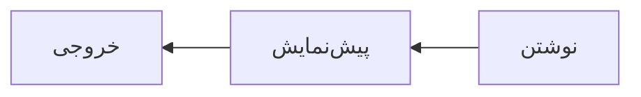

## کتابخانه‌ها

React یک کتابخانه است که برای ساختن رابط کاربری به کار می‌رود.

برای نصب، دستور `npm install react` را اجرا کنید و راهنما را در https://react.dev/learn بخوانید.

- کامپوننت‌ها قطعه‌های مستقل رابط هستند.
- هر کامپوننت ورودی‌هایش را از `props` می‌گیرد.
- [x] نوشتن یادداشت انتشار
- [ ] هماهنگی با تیم پشتیبانی

> رابط کاربری تابعی از وضعیت است.

The Farsi word for library is «کتابخانه», and it names this whole section.

### نمونه

```js
function greet(name) {
  return `سلام، ${name}`;
}
```

خروجی این تابع یک *خوشامدگویی* ساده و **بسیار** کوتاه است، و *React* هم *emphasis* می‌گیرد.

طبق قضیهٔ فیثاغورس، $a^2 + b^2 = c^2$ برای هر مثلث قائم‌الزاویه برقرار است.

| مرحله | مسئول | وضعیت |
|---|---|---|
| آزمایش | سارا | انجام شد |
| انتشار | علی | در انتظار |



---

1404
