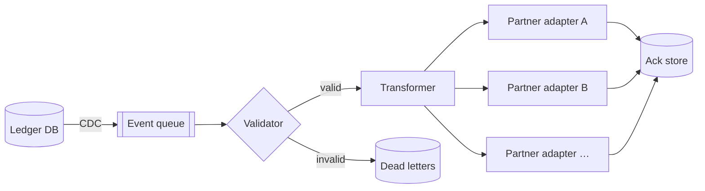
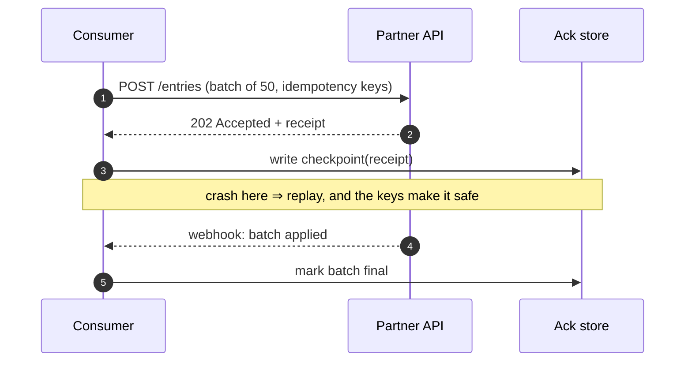
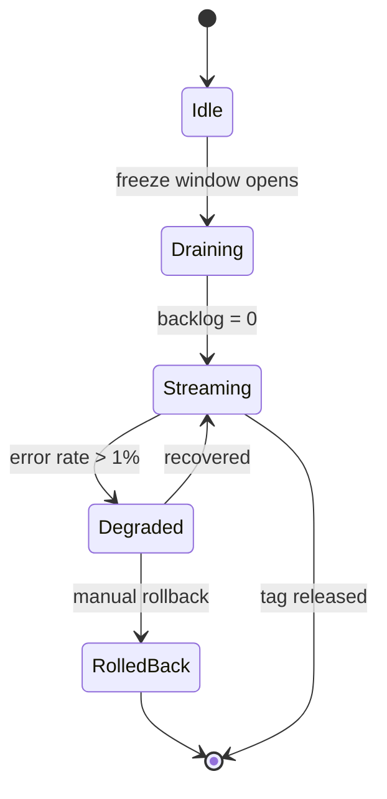
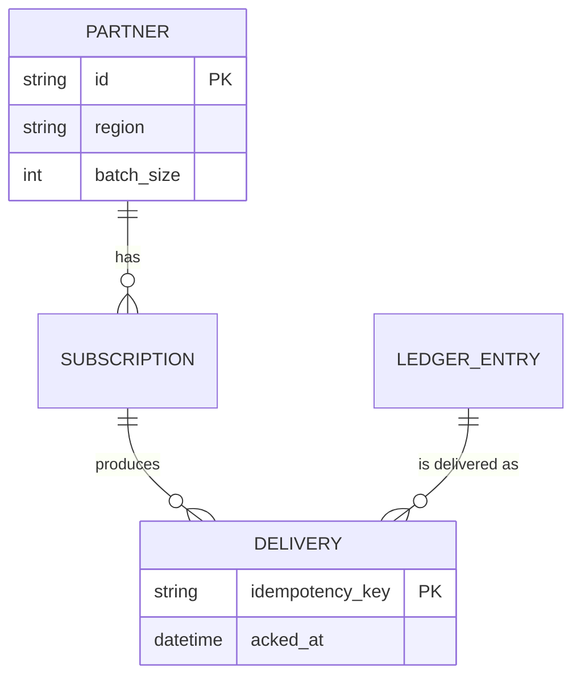
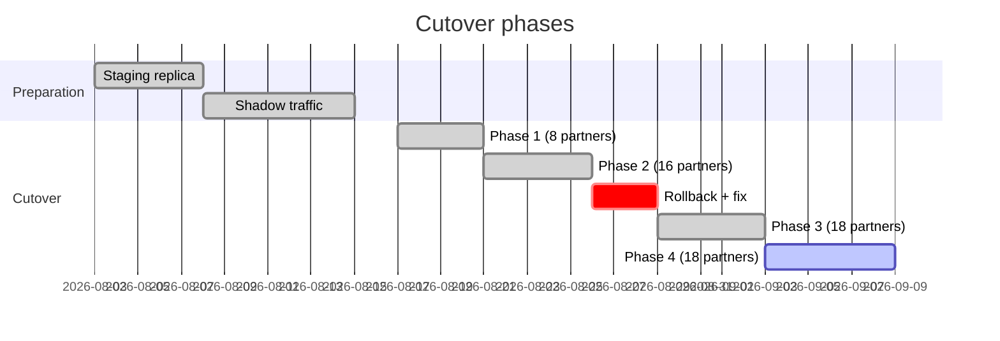
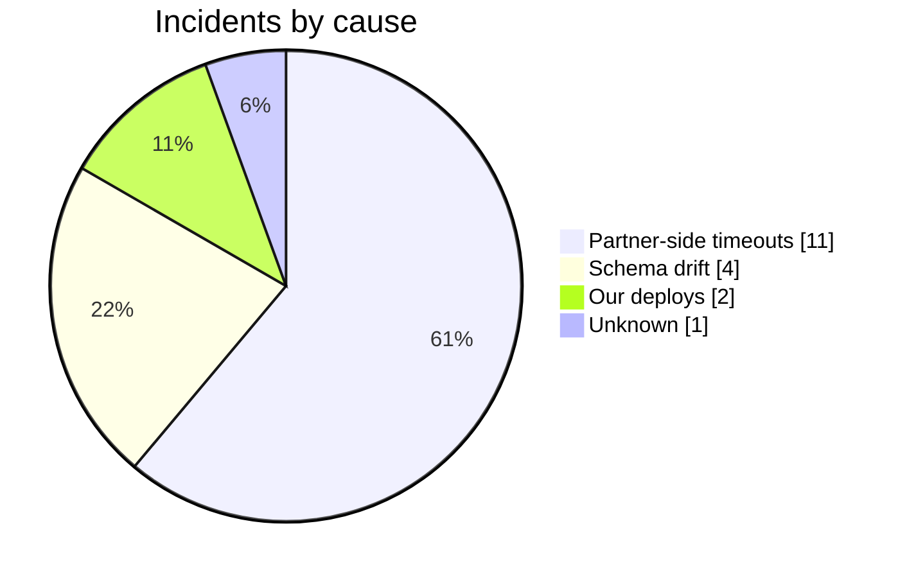

# Ledger Sync: Migration Report and Technical Reference

*A benchmark document for Jot's rendered view and PDF export. It deliberately uses every feature the renderer supports, at the upper bound of length and complexity. Export it to PDF and judge every page.*

**Status:** ~~draft~~ final · **Owner:** Platform team · **Last reviewed:** 2026-09-30

---

## 1. Summary

The ledger sync migration moved every partner integration from the legacy batch exporter onto a streaming pipeline. The cutover ran across **four phases** over six weeks, with *no* customer-visible downtime and one rollback, which the [rollback log](https://example.com/rollback-log "Internal rollback log") documents in detail. This report covers the procedure, the design rationale, the latency results for all sixty partners, and the reference material an on-call engineer needs.

Key numbers at a glance: median end-to-end latency fell from `412 ms` to `68 ms`, error budget consumption dropped by 71%, and the nightly batch window — previously four hours — no longer exists. See [Sources](#sources) for the dashboards behind these figures.

> **Note for readers of the PDF:** tables, code blocks, diagrams and formulas should never be split across a page break, except the partner table in section 5, which is longer than a page and *must* continue across pages with its header repeated.

## 2. Background

### 2.1 Why the batch exporter had to go

The batch exporter was written in 2019 for eight partners. It now serves sixty, and three structural problems compound:

1. It reads the **entire** ledger every night, so runtime grows with history rather than with change.
2. It holds a global lock on the reconciliation tables while it runs, which blocks
   1. manual corrections by the finance team,
   2. the fraud scoring job, and
   3. any schema migration, however small.
3. Failures are all-or-nothing: one malformed record aborts the run for every partner.

### 2.2 Constraints

- **No downtime.** Partners poll on their own schedules; some every minute.
- **No double delivery.** Every ledger entry is delivered *exactly once* per partner.
  - Idempotency keys are derived from the entry ID and the partner ID.
  - Replays after a crash must be safe.
    - The consumer checkpoints *after* the partner acknowledges.
    - A replayed entry with a known key is dropped silently.
- **Reversible until the tag.** Every step before the release tag can be undone in under five minutes.

### 2.3 Checklist before starting

- [x] Freeze window agreed with finance
- [x] Staging replica restored from the latest snapshot
- [x] On-call rota extended to cover the cutover nights
- [ ] Post-migration audit (scheduled for next quarter)

## 3. Architecture

### 3.1 Data flow



### 3.2 Delivery handshake



### 3.3 Component states



### 3.4 Data model



## 4. The maths behind the batch size

Each partner adapter sends batches of size $b$. With a per-request overhead $o$ and a per-entry cost $c$, the time to drain a backlog of $n$ entries is

$$
T(b) = \left\lceil \frac{n}{b} \right\rceil \cdot o \;+\; n \cdot c
$$

and the expected number of entries at risk in a crash is $\mathbb{E}[R] = \tfrac{b}{2}$, since a crash lands uniformly within a batch. Balancing drain time against replay cost gives the objective

$$
J(b) = \alpha \frac{n\,o}{b} + \beta \frac{b}{2}, \qquad b^{*} = \sqrt{\frac{2\,\alpha\, n\, o}{\beta}}
$$

For the partners with strict latency targets we also bound the tail. If latencies are log-normal with parameters $\mu, \sigma$, the 99th percentile is

$$
p_{99} = \exp\!\left(\mu + \sigma\,\Phi^{-1}(0.99)\right) \approx \exp(\mu + 2.326\,\sigma)
$$

The retry policy is piecewise:

$$
\text{delay}(k) =
\begin{cases}
0 & k = 0 \\
2^{k} \cdot 100\,\text{ms} & 1 \le k \le 5 \\
\text{give up} & k > 5
\end{cases}
$$

and the region weighting used for the capacity plan is the matrix product

$$
\begin{pmatrix} w_{\text{eu}} \\ w_{\text{us}} \\ w_{\text{ap}} \end{pmatrix}
=
\begin{pmatrix} 0.5 & 0.3 & 0.2 \\ 0.2 & 0.6 & 0.2 \\ 0.1 & 0.2 & 0.7 \end{pmatrix}
\begin{pmatrix} 1.0 \\ 0.8 \\ 0.4 \end{pmatrix}
$$

Prices in this document stay text: the staging replica costs $412 a month, the production one $1,650.

## 5. Results by partner

The table below lists every partner. It is intentionally longer than one page: in the PDF it must continue across pages, ideally with its header row repeated on each page.

| # | Partner | Region | p50 latency | p99 latency | Status |
|---:|---|---|---:|---:|---|
| 01 | partner-001 | eu-central-1 | 47 ms | 154 ms | migrated |
| 02 | partner-002 | eu-west-1 | 54 ms | 188 ms | in progress |
| 03 | partner-003 | eu-north-1 | 61 ms | 222 ms | blocked |
| 04 | partner-004 | eu-west-3 | 68 ms | 256 ms | migrated |
| 05 | partner-005 | us-east-1 | 75 ms | 290 ms | scheduled |
| 06 | partner-006 | us-east-2 | 82 ms | 254 ms | migrated |
| 07 | partner-007 | us-west-2 | 89 ms | 288 ms | migrated |
| 08 | partner-008 | ap-south-1 | 96 ms | 322 ms | in progress |
| 09 | partner-009 | ap-northeast-1 | 103 ms | 356 ms | blocked |
| 10 | partner-010 | sa-east-1 | 110 ms | 390 ms | migrated |
| 11 | partner-011 | eu-central-1 | 117 ms | 354 ms | scheduled |
| 12 | partner-012 | eu-west-1 | 124 ms | 388 ms | migrated |
| 13 | partner-013 | eu-north-1 | 41 ms | 152 ms | migrated |
| 14 | partner-014 | eu-west-3 | 48 ms | 186 ms | in progress |
| 15 | partner-015 | us-east-1 | 55 ms | 220 ms | blocked |
| 16 | partner-016 | us-east-2 | 62 ms | 254 ms | migrated |
| 17 | partner-017 | us-west-2 | 69 ms | 218 ms | scheduled |
| 18 | partner-018 | ap-south-1 | 76 ms | 252 ms | migrated |
| 19 | partner-019 | ap-northeast-1 | 83 ms | 286 ms | migrated |
| 20 | partner-020 | sa-east-1 | 90 ms | 320 ms | in progress |
| 21 | partner-021 | eu-central-1 | 97 ms | 354 ms | blocked |
| 22 | partner-022 | eu-west-1 | 104 ms | 318 ms | migrated |
| 23 | partner-023 | eu-north-1 | 111 ms | 352 ms | scheduled |
| 24 | partner-024 | eu-west-3 | 118 ms | 386 ms | migrated |
| 25 | partner-025 | us-east-1 | 125 ms | 420 ms | migrated |
| 26 | partner-026 | us-east-2 | 42 ms | 184 ms | in progress |
| 27 | partner-027 | us-west-2 | 49 ms | 148 ms | blocked |
| 28 | partner-028 | ap-south-1 | 56 ms | 182 ms | migrated |
| 29 | partner-029 | ap-northeast-1 | 63 ms | 216 ms | scheduled |
| 30 | partner-030 | sa-east-1 | 70 ms | 250 ms | migrated |
| 31 | partner-031 | eu-central-1 | 77 ms | 284 ms | migrated |
| 32 | partner-032 | eu-west-1 | 84 ms | 318 ms | in progress |
| 33 | partner-033 | eu-north-1 | 91 ms | 282 ms | blocked |
| 34 | partner-034 | eu-west-3 | 98 ms | 316 ms | migrated |
| 35 | partner-035 | us-east-1 | 105 ms | 350 ms | scheduled |
| 36 | partner-036 | us-east-2 | 112 ms | 384 ms | migrated |
| 37 | partner-037 | us-west-2 | 119 ms | 418 ms | migrated |
| 38 | partner-038 | ap-south-1 | 126 ms | 382 ms | in progress |
| 39 | partner-039 | ap-northeast-1 | 43 ms | 146 ms | blocked |
| 40 | partner-040 | sa-east-1 | 50 ms | 180 ms | migrated |
| 41 | partner-041 | eu-central-1 | 57 ms | 214 ms | scheduled |
| 42 | partner-042 | eu-west-1 | 64 ms | 248 ms | migrated |
| 43 | partner-043 | eu-north-1 | 71 ms | 282 ms | migrated |
| 44 | partner-044 | eu-west-3 | 78 ms | 246 ms | in progress |
| 45 | partner-045 | us-east-1 | 85 ms | 280 ms | blocked |
| 46 | partner-046 | us-east-2 | 92 ms | 314 ms | migrated |
| 47 | partner-047 | us-west-2 | 99 ms | 348 ms | scheduled |
| 48 | partner-048 | ap-south-1 | 106 ms | 382 ms | migrated |
| 49 | partner-049 | ap-northeast-1 | 113 ms | 346 ms | migrated |
| 50 | partner-050 | sa-east-1 | 120 ms | 380 ms | in progress |
| 51 | partner-051 | eu-central-1 | 127 ms | 414 ms | blocked |
| 52 | partner-052 | eu-west-1 | 44 ms | 178 ms | migrated |
| 53 | partner-053 | eu-north-1 | 51 ms | 212 ms | scheduled |
| 54 | partner-054 | eu-west-3 | 58 ms | 176 ms | migrated |
| 55 | partner-055 | us-east-1 | 65 ms | 210 ms | migrated |
| 56 | partner-056 | us-east-2 | 72 ms | 244 ms | in progress |
| 57 | partner-057 | us-west-2 | 79 ms | 278 ms | blocked |
| 58 | partner-058 | ap-south-1 | 86 ms | 312 ms | migrated |
| 59 | partner-059 | ap-northeast-1 | 93 ms | 346 ms | scheduled |
| 60 | partner-060 | sa-east-1 | 100 ms | 310 ms | migrated |

### 5.1 Summary by region

| Region | Partners | Median p50 | Worst p99 | Notes |
|---|:---:|---:|---:|---|
| Europe | 24 | 71 ms | 388 ms | Frankfurt primary; Dublin secondary |
| North America | 18 | 64 ms | 351 ms | us-east-1 carries 60% of volume |
| Asia Pacific | 12 | 83 ms | 402 ms | Tokyo latency dominated by partner side |
| South America | 6 | 92 ms | 377 ms | Single region; failover to us-east-1 |

A deliberately wide table follows; it has more columns than fit comfortably on a page:

| Metric | Week 1 | Week 2 | Week 3 | Week 4 | Week 5 | Week 6 | Target | Owner | Trend |
|---|---:|---:|---:|---:|---:|---:|---:|---|---|
| Deliveries (M) | 41.2 | 43.9 | 45.1 | 47.8 | 49.0 | 51.3 | — | Platform | rising |
| Error rate | 0.41% | 0.33% | 0.29% | 0.12% | 0.09% | 0.07% | < 0.10% | SRE | falling |
| Replays | 1,204 | 988 | 640 | 212 | 97 | 44 | < 100 | Platform | falling |

## 6. Timeline





## 7. Runbook

### 7.1 Cutover procedure

1. Confirm the freeze window with the on-call engineer.
2. Enable dual-write:
   ```bash
   ledger-sync config set dual_write=true --region eu-central-1
   ledger-sync status --watch   # wait until lag < 5s on every partner
   ```
3. Switch readers, one region at a time:
   ```python
   for region in REGIONS:
       switch_readers(region, target="stream")
       assert lag(region) < timedelta(seconds=5), f"{region} lagging"
       sleep(minutes=10)  # observe before the next region
   ```
4. Tag the release: `git tag -s ledger-sync-v2.0 -m "Streaming cutover"`.

### 7.2 Rollback

> If the error rate exceeds 1% for five minutes:
>
> 1. Switch readers back to the batch exporter.
> 2. Keep dual-write **on** — it is what makes the rollback lossless.
>
> > The rollback in phase 2 took four minutes end to end. The nested quote here is intentional: quotes inside quotes must render as such.

### 7.3 Configuration reference

```yaml
# ledger-sync.yaml — production
consumer:
  batch_size: 50            # b* from section 4, rounded
  max_in_flight: 4
  retry:
    max_attempts: 5
    backoff: exponential    # 100 ms · 2^k
partners:
  - id: partner-001
    region: eu-central-1
    endpoint: https://api.partner-001.example/v2/entries
```

```ts
// The idempotency key: stable across replays, unique per partner.
export function idempotencyKey(entryId: string, partnerId: string): string {
  return createHash('sha256').update(`${entryId}:${partnerId}`).digest('hex').slice(0, 32)
}
```

A long unbroken line inside code, to test wrapping and overflow:

```json
{"partner":"partner-042","region":"ap-northeast-1","endpoint":"https://api.partner-042.example/v2/entries/very/long/path/that/keeps/going/and/going/to/test/wrapping","batch_size":50,"retry":{"max_attempts":5,"backoff":"exponential"}}
```

## 8. Edge cases for the renderer

### 8.1 Inline formatting

Plain, *emphasis*, **strong**, ***both***, ~~struck~~, `inline code`, and a [link with a title](https://example.com "Example"). An autolink: https://jot.software. An email: <ops@example.com>. A very long URL that must wrap rather than overflow the page: https://example.com/reports/2026/09/ledger-sync/migration/phase-four/partners/all-regions/latency-histograms/p99-breakdown?format=pdf&include=raw

A reference-style link to [the design doc][design] and another to [the incident log][incidents].

Raw HTML is shown as text, never executed: <b>not bold</b> <script>alert(1)</script>

Unicode and symbols: café, naïve, Zürich, 東京, → ⇒ ≤ ≥ ≠ ∞, ✓ ✗, and a line of Farsi (right-to-left support is a to-do): «همگام‌سازی دفتر کل با موفقیت انجام شد»

An image from the web (should scale to the text width):


### 8.2 Headings, all six levels

#### Level 4 heading
##### Level 5 heading
###### Level 6 heading

Text after the smallest heading.

### 8.3 A deeply nested list

- Level one
  - Level two
    - Level three
      - Level four, with a longer line of text that should wrap cleanly under its own bullet rather than under the bullets above it
  - Back to level two
    1. An ordered list inside a bullet list
    2. Second ordered item
       - A bullet inside that
- Final level-one item

---

## 9. Conclusion

The streaming pipeline met every target except the replay count in week one, which settled by week four. The remaining work — the post-migration audit and the two partners still on the batch exporter — is tracked in the [follow-up plan](https://example.com/follow-up).

## Sources

1. Ledger Sync design document. Platform team, 2026. <https://example.com/design/ledger-sync>
2. *Designing Data-Intensive Applications*, Martin Kleppmann. O'Reilly, 2017. Chapter 11, "Stream Processing".
3. Latency dashboards, weeks 1–6. <https://example.com/dashboards/ledger-sync>
4. Incident log, phase 2 rollback. <https://example.com/incidents/2026-08-26>
5. Log-normal latency modelling: *The Tail at Scale*, Dean & Barroso. Communications of the ACM, 2013. <https://research.google/pubs/the-tail-at-scale/>

[design]: https://example.com/design/ledger-sync "Design document"
[incidents]: https://example.com/incidents/2026-08-26
